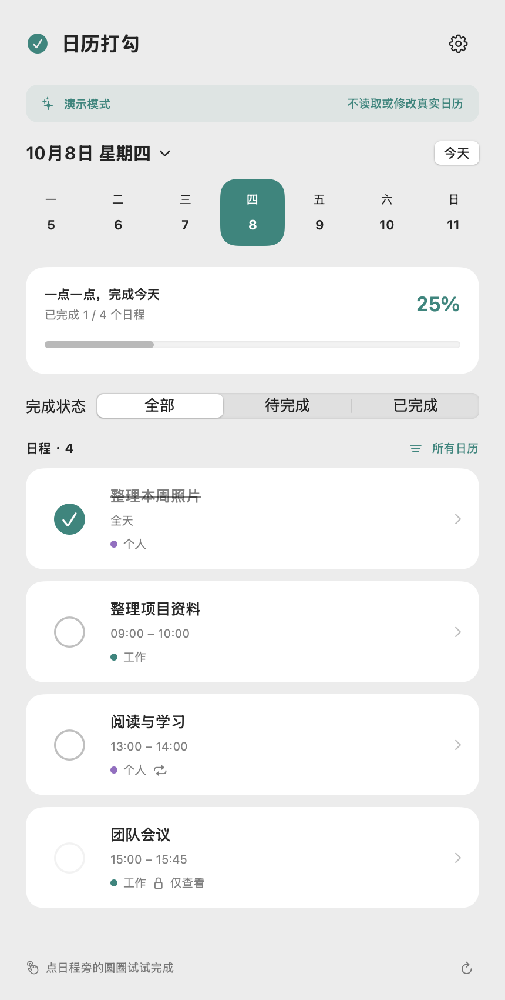

# 日历打勾 · iOS 中文原型

在自己的 App 里读取系统日历，轻点日程旁的圆圈完成或取消完成。与 Mac 版共用同一段完成标记代码：完成时给日程标题添加 `✓ `，取消完成时移除这个前缀。

**iOS 17 及以上，支持 iPhone 和 iPad。** 这是开发原型，需要用 Xcode 构建并签名后安装到 iPhone；尚未通过真机验证或发布到 App Store。

## 功能

- 中文日程列表、日期切换、完成进度和全部／待完成／已完成筛选。
- 按日历选择显示范围，区分账户来源与只读日历。
- 点圆圈完成，长按日程或进入详情页也可以操作。
- 启动、返回前台、系统日历变化及下拉刷新时重新读取日程。
- 免授权演示模式使用虚构日程，不读取或修改真实日历。
- 保存前重新读取并校验日程；重复日程只保存本次。

只读日历、已取消日程及带参与者的会议暂不支持修改。

## 与 Mac 共用日历

```text
Mac 日历打勾 → 系统日历账户 → iPhone 系统日历 → iOS 日历打勾
                   ↑             ↓
                   └── 日程标题包含 ✓ ──┘
```

两台设备登录同一个 iCloud 或其他日历账户，开启该账户的日历同步即可。日程标题由日历账户同步，两个 App 不直接连接，也不需要配对或额外注册。本机日历不具备跨设备账户同步功能。同步速度由账户服务和系统决定，本 App 不显示未经确认的“云端同步成功”状态。

iOS 版在自己的界面中操作，不会往苹果原生日历的菜单里插入按钮。原生日历可以看到同一条日程的 `✓` 标题。

## 在 iPhone 上试用

1. 在安装完整 Xcode 的 Mac 上，打开 `iOS/CalendarClick.xcodeproj`。仅 Command Line Tools 无法构建 iOS 应用。
2. 选择 `CalendarClick` target，在 **Signing & Capabilities** 中选择自己的开发团队并使用自动签名。
3. 连接 iPhone，按 Xcode 的设备准备提示操作，再选择该设备并点击 Run。
4. 首次打开时可以先选择“先试用演示”。使用真实日历时，点击“允许访问日历”并授予完全访问。
5. 查看日期和日历范围，点击一个日程旁的圆圈，再到苹果日历检查标题；另一台设备等待日历账户同步后刷新即可。

读取已有日程需要完全访问权限，写入权限本身无法读取日程。权限在系统设置中管理。本应用只请求日历权限，不请求辅助功能、提醒事项或通讯录权限。

## 构建与验证

从仓库根目录运行：

```sh
./iOS/check.sh
xcodebuild -project iOS/CalendarClick.xcodeproj -scheme CalendarClick \
  -sdk iphonesimulator -destination 'generic/platform=iOS Simulator' \
  -configuration Debug CODE_SIGNING_ALLOWED=NO build
```

`check.sh` 在 Mac 上验证完成标记、日程身份与时间校验、重复日程隔离、同步变化保护、日历筛选和演示模式。GitHub Actions 使用完整 Xcode 检查 iOS 模拟器构建。编译检查不等于真机权限、重复日程保存或跨设备同步验证。

## 在这台 Mac 上预览界面

```sh
./iOS/preview.sh
```

生成 `.build/iOSPreview/日历打勾-iOS预览.app`，打开后可以点击演示日程。它使用同一套 SwiftUI 界面与模型，但运行在 macOS 上，仅用于界面预览，不能切换到真实日历；它不是 iOS 模拟器。

下面是同一套界面在 Mac 上运行的演示预览：



## 隐私与实现

`CalendarRepository` 通过 EventKit 访问系统日历，所有 EventKit 操作串行执行。日程只在内存中显示，不创建额外日程数据库，不上传日历数据，不包含分析服务或直接联网代码。保存只修改实时重新读取的日程标题，其余字段取系统当前值。

工程直接引用 Mac 版 `Sources/CompletionCore.swift`，保持同一份 `✓ ` 标记规则。`AgendaCore.swift` 管理日程快照、精确校验与筛选；`AgendaModel.swift` 管理界面状态和刷新；`AgendaView.swift` 为中文界面。

- [Apple EventKit 访问级别说明](https://developer.apple.com/documentation/eventkit/accessing-calendar-using-eventkit-and-eventkitui)
- [设置 iCloud 日历同步](https://support.apple.com/zh-cn/guide/icloud/mme4d73a8727/icloud)
